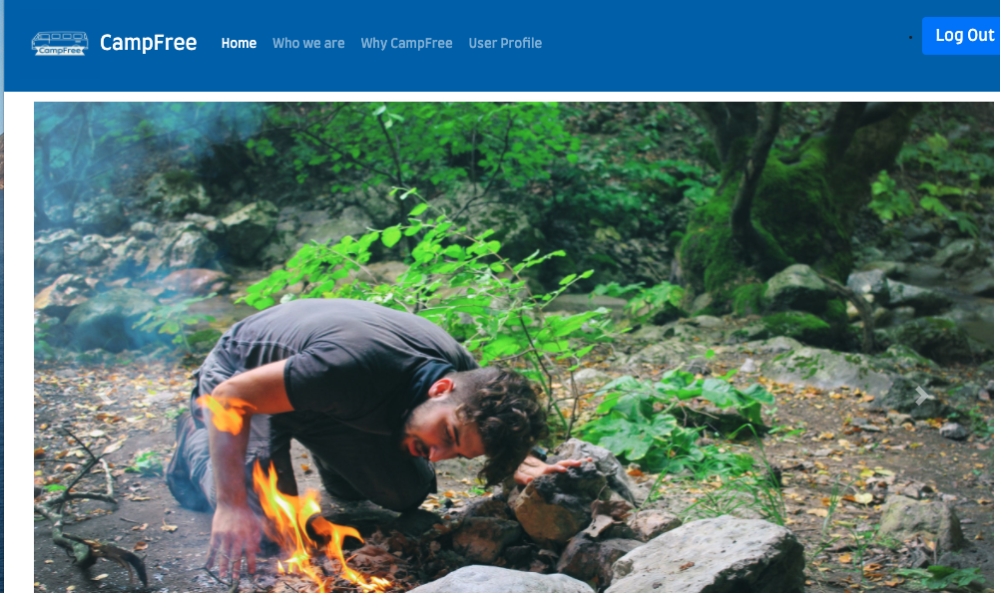
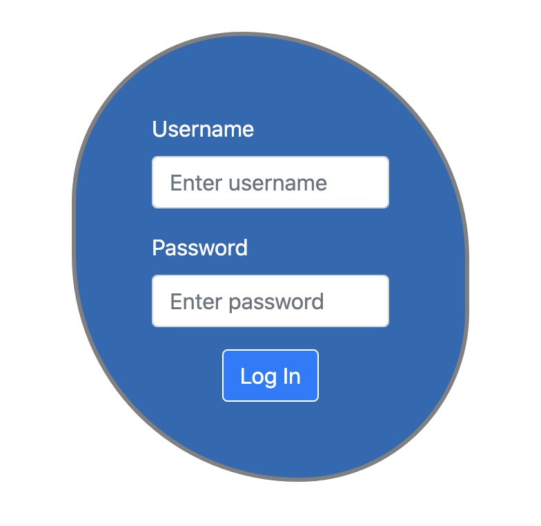
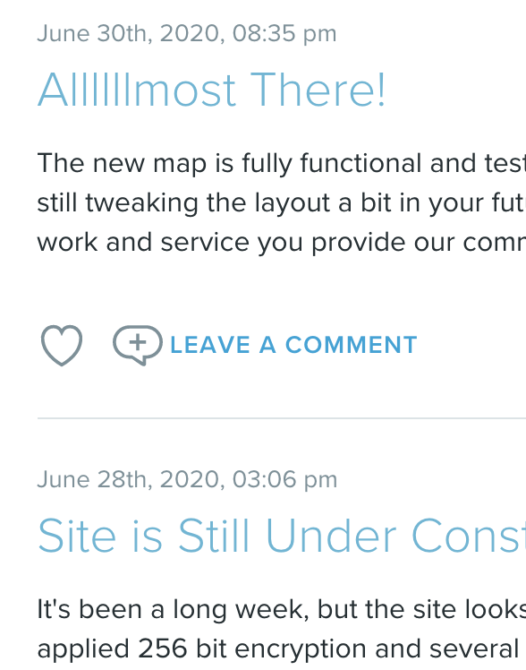
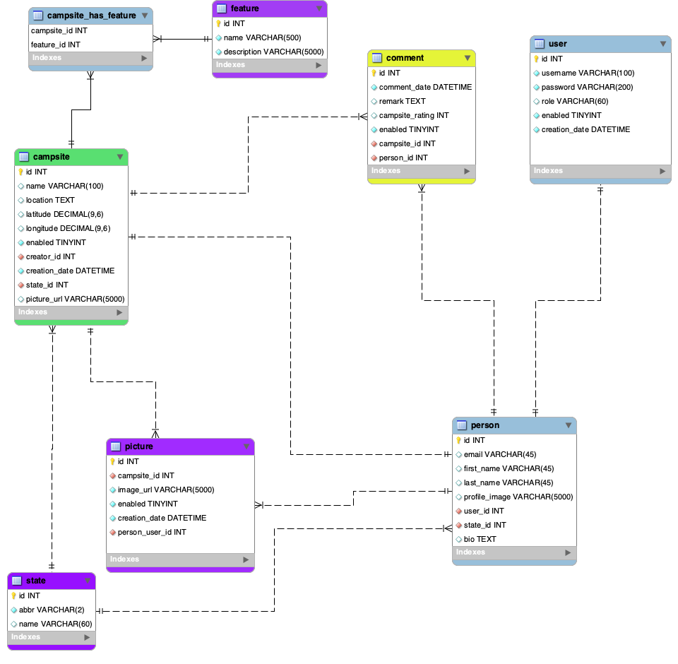
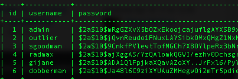
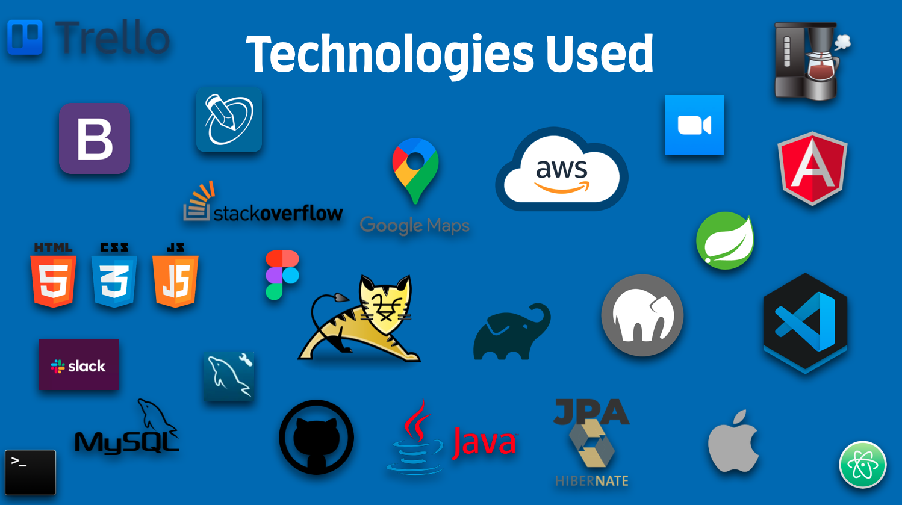

## CampFree

### Final Capstone Project for 16-week Skill Distillery Bootcamp

  This project is a culmination of our 16 weeks of training through the Skill
  Distillery Bootcamp and is a great demonstration of the full-stack skills learned
  through the program. The coding begins in the back-end with Java entities and
  displayed with an Angular front-end, with various technologies used in between.
  Software engineering principles highlighted include Object Oriented Programming,
  Test Driven Development, Pair-Programming, Git Collaboration, and User Story
  Requirements.

  Nearly all of this program was done remotely. The entirety of this project
  was done remotely across all 4 timezones in the Continental US and emphasized
  the importance of teamwork, patience, and persistence.   

***

### Team

* Michael Degginger- Developer, SCRUM Master, Plating Specialist
* Vince Borden- Developer, Database Administrator, Security Specialist
* Mike Matosky- Developer, Repository Owner, QA Specialist

***

### Overview

CampFree is a free application for the dispersed camping community that focuses
on crowd-sourcing created or existing campsites with no fees or reservations. While
some may opt to pay and hassle with reservations for busy campgrounds, not many
realize that there is plenty of public land available for camping which results
in a better connection with nature and a more somber camping experience.

The functionality focuses on the profile page and the main homepage with the map
and expansive list of interactive campsite data. This map and list is reliant on
crowd sourced data from its enthusiastic users.

***

### Link to the live site

[Come on in and check us out!](https://www.youtube.com/watch?v=dQw4w9WgXcQ)

TODO: Link to deployed project, credentials to log in, explanation of how to use

## Screenshots

Interactive Map

***

Homepage Carousel

***

Login Egg

***

Have you checked our blog?

***
### User Stories

* A nonuser can view all created campsites and their details.
* A nonuser can register a new account and profile and become a user.  
* A user can view all created campsites and their details.  
* A user can view their personal profile information, including a user picture.
* A user can create a new campsite with detailed information and a picture.
* A user can edit their own campsite creations.   
* A user can delete their own campsite creations.
* A user can view a list of their created campsites on their profile page.
* A user can view a gallery of their photos on their profile page.
* A user or nonuser can view dispersed camping education, dispersed camping tips, and information about CampFree.
* A user can log out.
* A user can comment on created campsite.
* A user or nonuser can view all comments on all campsites.

***

### Database Model

***

### Sample Table Data

This is a sample from the user table showing the passwords are NOT saved in plain text

***

### Routing Endpoints

***

### Technologies Used

***

### Lessons Learned

1. The importance of descriptive but uniformly named variables.
2. Pair programming is great for preventing common mistakes and can solve most issues better than one alone.
3. Leave CSS and layout issues until the end when you have all of the data populated.
4. Decisions you make on the first day can make or break your product.
5. Copy/Paste is your friend until it isn’t.
